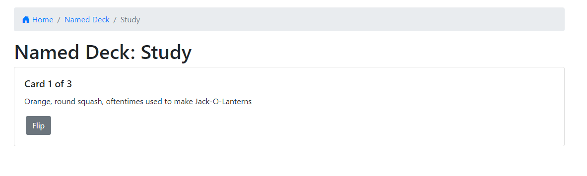
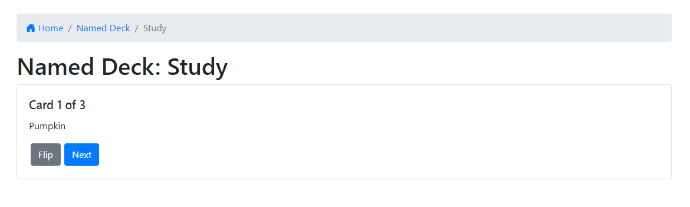

# Flashcards

The title says it all: This app is a handy tool to help you study, taking the physical form of flashcards and packing it into an easy-to-use multifuctional app.

### Home Page:

## Instructions

### Create/Delete Deck:

* On the Home page, click the +Create Deck button to create a new deck.
* On the Home page, click the red button to the right of the deck information to delete a deck.

* Enter your chosen deck name and provide a brief description. Clicking Submit will submit your deck to the app.

### Edit/Add/Delete Cards:

* Clicking the Edit button will open a prompt to edit either side of your flashcard.
* Clicking the Add Cards button will open a similar page to edit your newly-added card.

* Clicking the red button to the right of the card information will delete the card.

### Study Deck:

* Clicking the Study button will open a page with one side of your first card.

* Clicking Flip will reveal the other side of the flashcard.
  * Whether the term/answer or the definition/question are shown first is dependent on the contents of Side 1 and Side 2 of each card. Side 1 is shown first for each card.

* Clicking Next will move on to the next card.

## App Information

### Technology Used:

* React / React Router
  * Created with [create-react-app](https://github.com/facebook/create-react-app)

  
